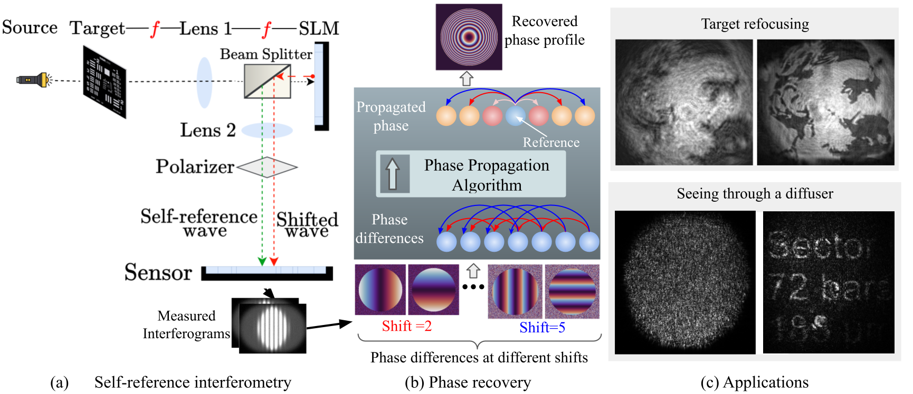
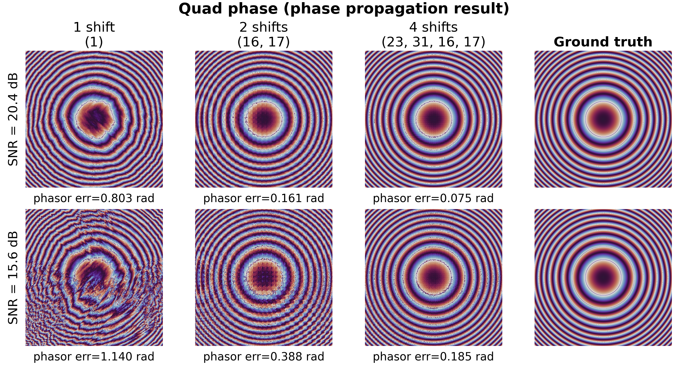
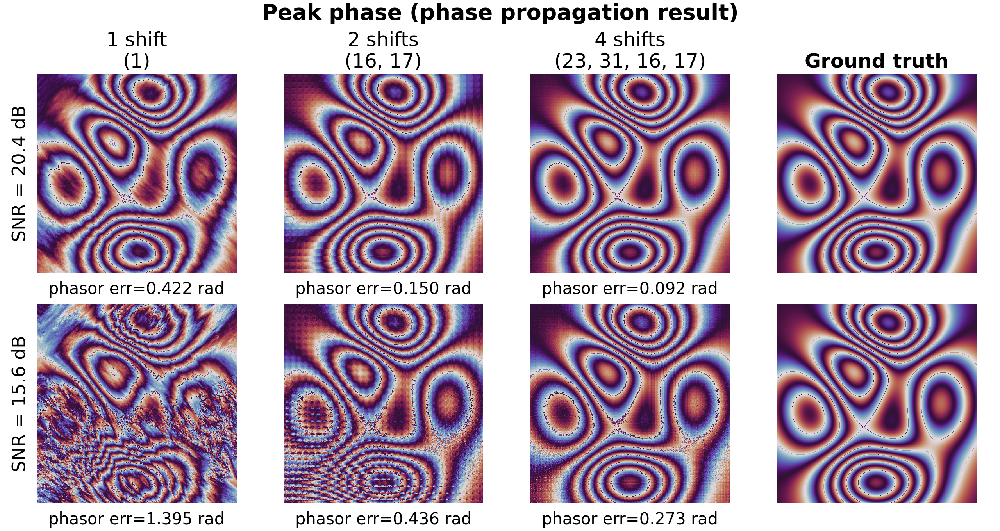

# Provable and Robust Wavefront Sensing via Self-Reference Interferometry


Nebiyou Yismaw<sup>1</sup>, Vishwanath Saragadam<sup>1</sup>, Aswin C. Sankaranarayanan<sup>2</sup>, M. Salman Asif<sup>1</sup>

<sup>1</sup>University of California, Riverside &nbsp;&nbsp;<sup>2</sup>Carnegie Mellon University

[](https://csiplab.github.io/coprime-psi/)
[](https://arxiv.org/abs/2604.03564)



## Overview

Conventional interferometric approaches like phase-shifting interferometry
(PSI) can recover phase information, but they rely on a stable reference
beam that is difficult to realize in practical settings. We propose a
self-reference framework that instead interferes an incoming wavefront with
spatially shifted copies of itself, producing pairwise phase differences
between shifted pixels. These differences are propagated across a connected
graph to recover the complete phase profile, with co-prime shifts proven to
guarantee full connectivity and bound worst-case error accumulation.

This repository contains the core phase-recovery algorithm, a simulator for
generating synthetic coprime-shift measurements, and scripts to produce results.

## Installation

```bash
git clone git@github.com:CSIPlab/coprime-psi-code.git
cd coprime-psi-code
pip install -r requirements.txt
```

Requires Python >= 3.9. Sample images can be found in `data/div2k_samples/`.

## Quick start

The pipeline is three scripts: generate measurements, recover phase, then
summarize results across shift sets.

```bash
# 1. Simulate coprime-shift PSI measurements (writes to ./measurements/simulated/)
python gen_simulated_data.py --phase-types peak --shifts 0,1,16,17

# 2. Recover phase from those measurements (writes figures/results to ./results/)
python recover_phase.py --phase-types peak --shift-groups "1;16,17"

# 3. Compose a comparison grid across shift sets (recovered phase per shift
#    set, ground truth rightmost, measurement SNR in the title)
python summarize_results.py --phase-types peak --shift-groups "1;16,17"
```

For additional details, run any of them with `--help`.

## Code structure

- `recover_phase.py`: main entry point. Loads measurements, runs coprime-shift
  phase recovery (BFS phasor propagation + least-squares refinement), and
  saves the figures described in [Outputs](#outputs) below.
- `summarize_results.py`: run after `recover_phase.py`; composes a comparison
  grid across shift sets from the results it already saved.
- `recovery_algorithms.py`: the recovery algorithms themselves. Two BFS
  phasor-propagation implementations of **Algorithm 1** in the paper are
  included:
  - `integrate_coprime_bfs_v3`: the vectorized/parallel formulation used by
    `recover_phase.py`, where every visited pixel propagates to its
    neighbors simultaneously via tensor ops each iteration (matches the
    paper's "efficient parallel implementation" of Algorithm 1).
  - `integrate_coprime_bfs_v2`: a sequential, one-pixel-at-a-time queue
    implementation matching Algorithm 1's pseudocode directly. Kept as a
    readable reference, not called at runtime (its least-squares tail is
    unfinished/non-functional).
- `gen_simulated_data.py`: simulated coprime-shift PSI measurement
  generation (4f optical system + SLM phase encoding).
- `psi_least_sqaures.py`: closed-form Fourier-domain least-squares phase
  refinement (Algorithm 1's refinement step).
  
## Outputs

Running `recover_phase.py` writes figures and data for each `(experiment, shift
set)` combination to `{results_dir}/{exp_name}/`. By default only the main
output is generated:

| File | What it shows |
| --- | --- |
| `summary_{shifts}.png` | Ground truth phase and recovered phase side by side (recovered phase re-referenced to the ground truth's global phase), with MAE and phasor error in the title. Start here. |
| `U0_recovered_{shifts}.npz`, `U0_recovered_LS_{shifts}.npz` | Recovered complex field (amplitude + phase), before/after least-squares refinement. |

`{results_dir}/{base_exp_name}_{noise}_error_analysis.csv` collects
MAE/MSE/circular-MAE/phasor error across every shift set tried for that
experiment and noise setting. `summarize_results.py` additionally writes
`all_shifts_summary.png` per experiment.

Pass `--debug` to also save a larger set of per-shift diagnostic figures
(phase differences, hop-count error curves, recovered-phase-only plots, etc).

## Results

Recovery quality improves with more coprime shifts, for both phase types and at
both SNR levels. Suboptimal shift sets, such as a single shift (`[1]`), increase
the number of hops needed to reach each pixel and lead to poorer reconstruction
quality. Each additional shift contributes an independent phase-difference
measurement per pixel, giving the BFS graph more redundancy to average over and
shortening the typical hop distance to the reference pixel, both of which reduce
phasor error.

<p align="center">
  
  
</p>


## Citation

If you find this work useful, please cite it. We will update this citation
once the ECCV proceedings version is available.

```bibtex
@article{yismaw2026provable,
  title   = {Provable and Robust Wavefront Sensing via Self-Reference Interferometry},
  author  = {Yismaw, Nebiyou and Saragadam, Vishwanath and Sankaranarayanan, Aswin C and Asif, M Salman},
  journal = {arXiv preprint arXiv:2604.03564},
  year    = {2026}
}
```

## License

MIT. See `LICENSE`.
